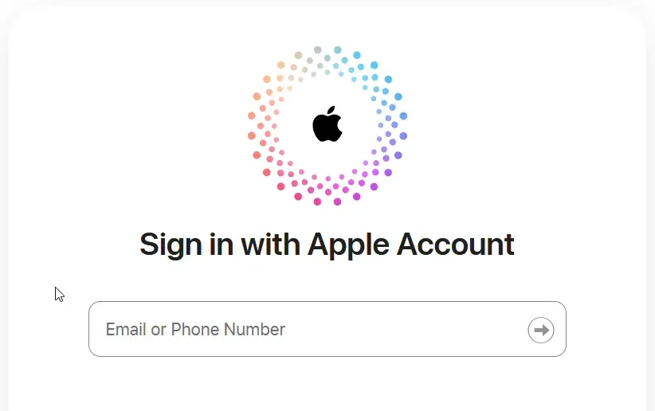
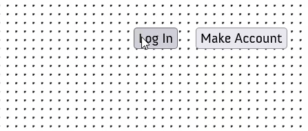
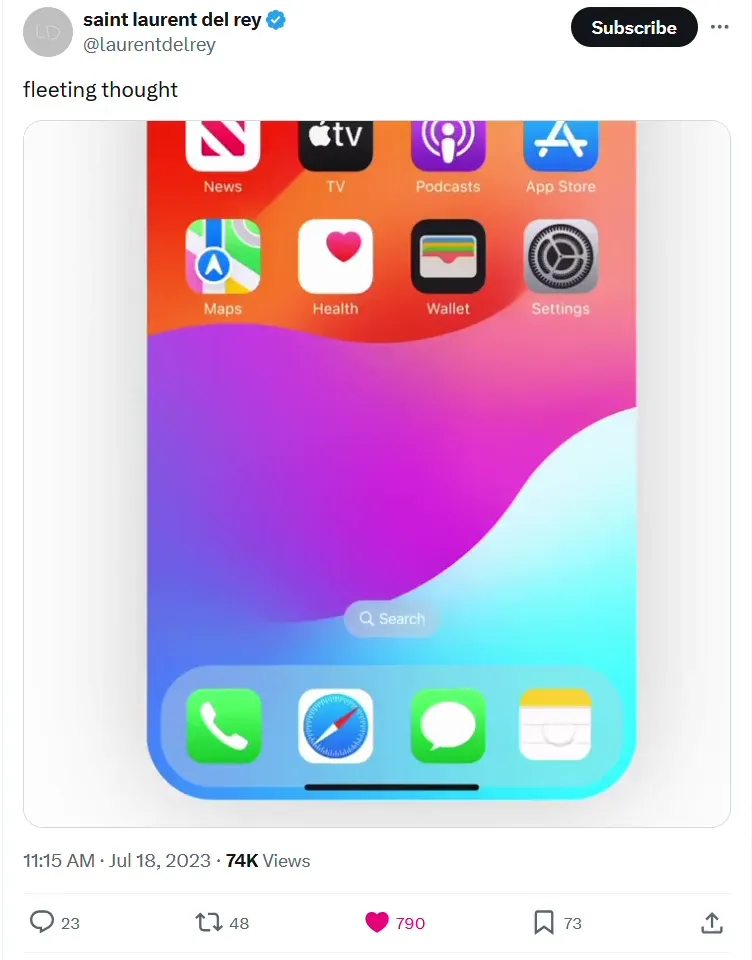

Something I enjoy is when your focus doesn't have to jump around a whole bunch when using a computer program. One classic example of UI that manages the user's focus is the humble [float label](https://x.com/mds/status/1792569012905263143):

<!-- more -->

The label draws your eye directly to the form field you're supposed to fill in, and then when the user starts typing, the label moves up and out of the way, and they're already looking at the place where their words appear. The placeholder text is instantly reused as the label. Genius.

Here's a slightly less conventional example from a website I once designed:

Each page has the "log in" and "make account" buttons you'd expect a website to show you when you're not logged in, but the "Log in" button just unveils the necessary fields instead of taking you to a separate "log in" page, and the button itself is instantly reused as the final "submit login credentials" button. The focal point of the interaction (the login button) is held constant the whole time, while only a couple of new things appear around it.

In general, I prefer this approach over being sent to a new page if it's not actually necessary; it's easier and faster than being moved to a login page and then moved right back to the page I was already on, except that I'm logged in now, hopefully. (Why would you need a whole page just to log in? It's like two form fields.) (Note that this usually requires keeping significant state on the client side to pull off smoothly, so that you can switch from the logged-out view to the logged-in view without refetching the page from the server.)

This is also why I made an in-place editor for the complicated spreadsheet I use to track research papers:

<video alt="One of a series of spreadsheet rows describing research papers expands to show a series of input fields for the paper's name, authors, tags, and so on." controls src="../../.../../../assets/posts/eyeline-ui/compact-spreadsheet.mp4"></video>

The conventional way to handle that interaction would have been to create a whole separate page, or maybe just a modal, in which the data for the paper could be edited. But that would involve a full UI context switch, and it wouldn't be as fun a way to edit weird nested data structures.

The first place I remember seeing this kind of in-place data editing was on Trello, years ago (although access to their nested fields takes slightly more clicks than mine):

<video alt="A pencil icon is clicked on a card in a Kanban board full of Minecraft projects. The card's description, which reads 'Improve house interiors', becomes editable, and buttons on the side show up that let you add things like dates and labels to the card." controls src="../../.../../../assets/posts/eyeline-ui/trello.mp4"></video>

You can see how this approach also keeps more context on screen for the user, with the content of the card remaining visible while you add dates and labels and stuff to it.

I think part of the reason why I enjoy this trend is the creativity - it's fun to see UI [shapeshift](https://www.youtube.com/watch?v=y69gQtAdHKc&t=59s) in place to meet your needs, instead of just staying static.

<video alt="A very short clip from the movie Nimona, in which the protagonist transforms from a rhino, to an armadillo, to a bear, to a bird, to a meerkat, all while rapidly pushing one of the other characters down a hall." controls src="../../.../../../assets/posts/eyeline-ui/nimona-shapeshift.mp4"></video>

[Here's](https://x.com/laurentdelrey/status/1681321861106524162) another fun example of keeping something in context, on screen, for longer than you'd expect:

In real life, Apple would never let you add dynamic, custom content to their phone's home screens like that. Imagine the chaos if every app did it. Implementing highly integrated UI elements takes care and planning, to make sure it all fits together and nothing interferes with anything else. (You have to consider: will there be room for a dynamic login form to pop in on every page on your site? There probably could be, but you have to plan for it.) But when it works, I think it's neat.
