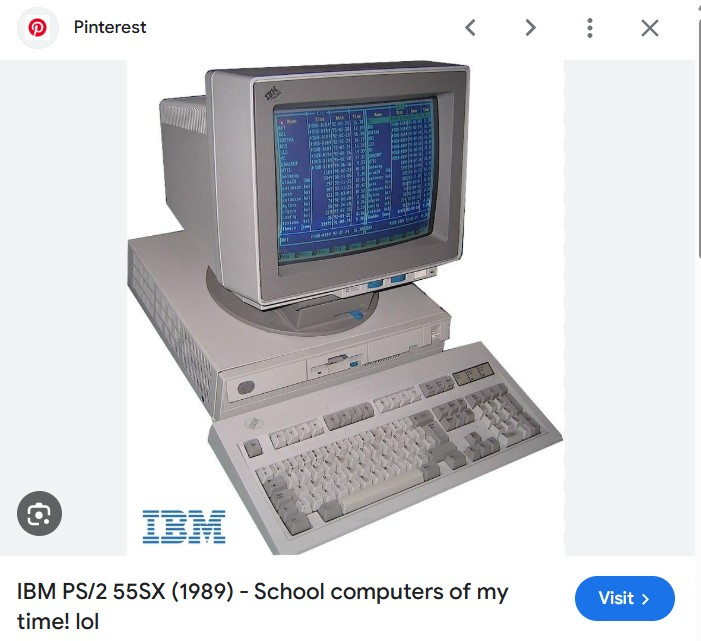

The animated GIF is a new kind of ideogram that computers have added to our lives. (An [ideogram](https://en.wiktionary.org/wiki/ideogram) is a visual symbol that indicates an idea without corresponding to any specific spoken sounds.) You can convey a vibrant feeling in a brief moment of video, as long as the feeling is along the lines of: Leonardo DiCaprio [raising a wine glass](https://media3.giphy.com/media/v1.Y2lkPTc5MGI3NjExaWRxcWFqd3RtaG4zZHY3ejg4eDI1MjA0ZjdjbmdpZTZvdjdnOXF4eSZlcD12MV9pbnRlcm5hbF9naWZfYnlfaWQmY3Q9Zw/8Iv5lqKwKsZ2g/giphy.gif). Donald Glover carrying pizzas reaching a room filled with [flames](https://media1.giphy.com/media/v1.Y2lkPTc5MGI3NjExbDNlZWl2MDdkZnBud3Z3bW0wbzB2cnBjYnh3ZGJvZmVxdG1mMndoYyZlcD12MV9pbnRlcm5hbF9naWZfYnlfaWQmY3Q9Zw/BfiL8ZJWqfw7C/giphy.gif). A white guy [blinking](https://media3.giphy.com/media/v1.Y2lkPTc5MGI3NjExZ3B3MTg4OW85d3Bsd3Q3cGI0eGdmbWR2ZGNtdmc0NmlzMXN4NmF4OSZlcD12MV9pbnRlcm5hbF9naWZfYnlfaWQmY3Q9Zw/l3q2K5jinAlChoCLS/giphy.gif) in idle consternation.

So why is the GIF under attack? Everywhere, platforms and hosting services are trying to replace it with other file formats. "GIFs" on Twitter are [MP4 videos](https://video.twimg.com/tweet_video/GfrPv5-WIAA9Uui.mp4), set to be soundless and looping. Imgur introduced the concept of "GifVs," which are mp4 or WebM videos that are displayed like GIFs, [way back in 2014](https://web.archive.org/web/20200505012906/https://blog.imgur.com/2014/10/09/introducing-gifv/). The framework I'm using to create this blog, [Astro](https://astro.build/), will automatically turn GIFs into WebP files when I deploy the site to production. One of the ground zeroes for the animated GIF phenomenon, Tumblr, has been experimenting with videos-as-GIFs for years, writing [extensive, carefully-worded posts](https://engineering.tumblr.com/post/690135035533230080/making-gifs-load-faster) to try to introduce the concept without angering their userbase.

And make no mistake - users hate new file formats, like WebP. Statistically, you probably hate .webp files already. Here's what a brief Google search has to say about them:

<!-- NOTE: many of the assets in this post are served from "public" instead of "assets" because i *don't* want them to be transformed and optimized - that would keep them from illustrating the points about file formats i'm making -->

So why does this format exist? Why do any file formats exist? Why do I care? Let's consider the practicalities.

<!-- more -->

## The file format rumba

Let's assume that I'm starting a new social network, and I want users to be able to share animations with each other. Specifically, this brief clip from the movie "Wicked:"

<video controls src="/posts/gif/galinda-feeling.mp4"></video>

We don't want to overcomplicate things with weird file formats, so we'll keep this simple. This clip consists of 96 individual frames played in sequence. We'll just convert each of those frames to a BMP image, which is an antique file format from Microsoft Paint that doesn't use any kind of image compression, and ask users to download the BMPs and flip through them in their device's image viewer.

Problem solved 😌 except, wait,

The size of all these frames as BMP files is 569mb, which would take about 45 seconds to download over the 100mbit/s Wi-Fi connection at the Dunkin' I'm writing this at. For comparison, the original MP4 file of the clip that I posted above is 2.85mb. By converting each frame to a BMP file, we've increased the amount of data needed for the result by about 200x.

We can fight this by cropping the video to be more centered and reducing the height of each frame to 400 pixels tall, but the result is still 77mb, which is gigantic. Let's try another way. Here is a .webp version of the clip, with that same cropping and resizing applied:

The result is 3.46mb. So, about 1/20th the size of the BMP version. The WebP format is pretty efficient. And lastly, let's look at a .gif. This is an authentically sourced .gif from [a Tumblr post](https://laurens-german.tumblr.com/post/776175949031047168/ill-say-this-much-she-doesnt-give-a-twig-what) that features several GIFs from the movie "Wicked:"

This GIF file is a little under 10mb. So, it's way smaller than the naive approach of just outputting every frame in an older file format without compression, but larger than the .webp. So .webp... wins?

## The relative value of pictures and words

Objectively, on the technical merits, the .webp format is the more efficient way to share short video-ish clips over the Internet. If you use WebPs instead of GIFs on your social media platform, users' posts will load faster, and you'll pay less for bandwidth to your hosting provider. (It's a little better at compressing still images than older file formats like JPEG, too.) This makes sense: the WebP format was developed by Google in a lab in the late 2000s, whereas the .gif format was most recently standardized in [1989](https://www.w3.org/Graphics/GIF/spec-gif89a.txt), and was meant for sharing clip art on computers that literally looked like this:

<!-- could make point about GIFs' limited color palettes, but comparing compression methods is probably too far into the weeds -->

But it just feels wrong to say that the GIF file format isn't the best way to share GIFs. I mean, that ignores what a GIF _is_, right? Just as each individual GIF is a new ideogram in our shared online language, the term "GIF" is a new morpheme: a discrete unit of writing that signifies a specific concept, namely, a short, soundless video that's usually small and loops. You can post GIFs. You can GIF things. "WebP" has not achieved that status as a noun or verb yet.

Also, wait a second. At very beginning of this post, I introduced this clip from Wicked with a .mp4 file that I sourced from [the official Youtube video](https://www.youtube.com/watch?v=amgPXKrFZVg) of the relevant scene. That .mp4 file was 2.85mb: smaller than _any_ of the alternatives. How is that possible?

## The file format is the medium is the message

<!-- GIF as a concept vs. GIF as a file -->

Infamously, that 1989 [specification](https://www.w3.org/Graphics/GIF/spec-gif89a.txt) for the .GIF format says this:

> Appendix D. Conventions.

> _Animation_ - The Graphics Interchange Format is not intended as a platform for animation, even though it can be done in a limited way.

In other words, pointing out that the .gif file format is old and decrepit is only telling half of the story. Not only is it old and decrepit, _it wasn't even intended for animations in the first place._ The original creators of the .gif format left a window open, though, by making it possible to store multiple images in a single .gif file and play them one after the other, and in doing so they closed a door: generations of Internet users have bonded to GIFs and reject attempts to switch over to a purpose-built animation format.

Similarly, everyone "just knows" what mp4s are for: videos. Like, the kind with sound, and high resolution, that you're probably meant to play in full screen. But this is also just a cultural perception. It didn't have to be this way; the same compression techniques that make it easy for an mp4 to store "real" videos at reasonable file sizes make it excellent at storing short clips at tiny file sizes.

But "GIF" means what it means. It's a term that has transcended its technical specs to become a new kind of content for the ages: the kind that [shows](https://media4.giphy.com/media/v1.Y2lkPTc5MGI3NjExb285dDVwY2hoM3Z4cDVvajYwNGV0NDJ6ejJzZWdnNmsxNDI0N2ppeSZlcD12MV9pbnRlcm5hbF9naWZfYnlfaWQmY3Q9Zw/JTzPN5kkobFv7X0zPJ/giphy.gif) Steve Buscemi rocking up to a high school with a skateboard and a "Music⚡Band" shirt, saying "How do you do, fellow kids?" Whereas MP4s are how you store the episode of 30 Rock that that clip is originally from. It's hard to even say that a GIF is a video clip, or an animation. It's just a GIF.

(Also, to be fair, older browsers were able to embed GIF players where it would have been hard to embed more technically demanding MP4 players, and not all MP4s are saved with maximally efficient compression since they're not all intended to be distributed over the Web. Today, as you can see in this very example, these things are no longer a big concern.)

It isn't technically hard to start using .mp4 files where we've been using GIF files. As mentioned at the top of this post, platforms like Twitter and Imgur are already doing it, and have been for years. The problem is cultural: storing GIFs as MP4s ignores the contrastive function of the term "GIF." There are attempts to standardize new terms like "GifV" to indicate "conceptually a GIF, but stored in a non-GIF file format," but nothing has stuck yet.

Similarly, it probably wouldn't be all that hard to get people to hate WebP files less. As far as I can tell, the biggest problem is that when people save WebP files, the image viewer on their phone and/or computer doesn't know how to show them the files. The Windows "Photos" app on my computer certainly does a terrible job of it: it will open WebP files, but just shows me the first frame, as if they're not animated. I have limited insight into how Microsoft develops their "Photos" app, but I have a hard time believing that it's impossible for them to support animated WebP files: old freeware programs like [IrfanView](https://www.irfanview.com/) and [ffmpeg](https://www.ffmpeg.org/) manage it just fine. The fault doesn't lie in the WebP format itself, but rather its adoption by native phone and desktop apps, which probably has a circular relationship with users' lack of enthusiasm for it.

Unfortunately, this kind of techno-cultural conflict leaves us with large files stored by ancient file formats that suck at their jobs. But culture optimizes for a different kind of compression: the term "GIF" is, in fact, extremely efficient, when you hear it or read it, at describing a certain kind of what you'd otherwise have to call a video clip. The GIF-as-file-format is outdated, but the GIF-as-concept is still alive and kicking. And maybe "slowly" is just how GIFs, as a concept, are supposed to load.

## Appendix A: Art Direction

The GIF from Tumblr showing the clip from Wicked looks different than the examples I created, colors-wise, because people have learned how to tune the GIF format to get the result to look how they want. It's another element of the cultural side of this, and a big reason why [the post from Tumblr's engineering team linked above](https://engineering.tumblr.com/post/690135035533230080/making-gifs-load-faster) had to be so careful to justify their choice to use non-GIF files: creative people have learned to work with the file format and take advantage of things like the limited color palette when shaping their short animated creations, creating tutorials like [this one](https://www.tumblr.com/yesloulou/728649525371289600/alexis-what-settings-do-you-export-your-gifs?source=share), and they don't want to see that art disappear. You can do the same kind of color science to normal videos (that's how they made the movie "Wicked" in the first place), but it takes a different approach, relies on different software, and doesn't naturally lead to the same results.
