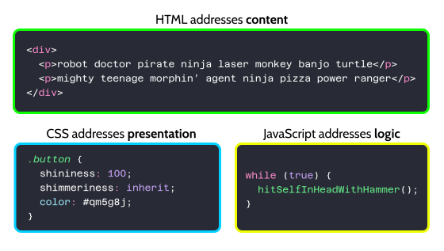
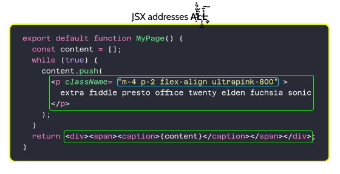

The term "separation of concerns" gives you an easy way to throw a wrench into almost any programming argument. It's hard to interpret at the best of times, but it definitely sounds weighty and important, and so you can use it to argue against any code that you don't like and for any code that you do like. Here are some models for separation of concerns that I have seen:

## Model A: The Language Model

A one point, in the world of web development, it was easy to tell which part of the code was which, because each concern was addressed by a different language. The HTML created the content, the CSS established the styling, and the JavaScript added the interactivity:

<!-- more -->

The idea was that all of this code would kind of stand alone, so you could have something like [the CSS Zen Garden](https://csszengarden.com/) where the same content is styled in all kinds of different ways. That's not really how we do web development anymore. The modern approach is more like:

## Model B: The Component Model

In a modern JavaScript framework like React, content, styling, and interactivity are all mixed together:

Does this make things less organized? Well, kind of. Technical concerns are no longer separated. Instead, code is structured according _logical_ concerns, i.e. by which parts of the UI do what: the code for the search boxes is grouped into one component, and the code for the image carousels is grouped into a different component; instead of the content for the image carousels being in HTML, and the styling of the image carousels being in CSS, and the code that makes the whole thing interactive being somewhere else in a .js file.

Basically everyone prefers this, although few people will explicitly tell you why. It is easier to think about components in the abstract instead of layers of technical concerns, and at this point, basically everyone who works on the frontend of web apps is expected to be able to implement all of the parts of a component. In fact,

## Model C: The Full-Stack Model

It's more and more common to mix together code that runs in a user's web browser and code that runs on the server that the web browser is talking to. In this simple example from a presentation about React Server Components, some of this code is backend code that will be running on a rack-mounted server in an AWS data center in Virginia, and some of this code is frontend code that will be running in the background of mobile Safari on someone's grandma's iPhone SE in a fishing shack in Maine, and both of those ends are together in one component:

The fact that this is a thing now is a testament to how thoroughly the technical concerns of web development have been abstracted away, a phrase which here means you don't have to think about how they work. Not only does the code that controls the search box's placement in the page layout not have to be separate from the code that suggests results as you type, but the code that pulls the suggestions from some data center doesn't have to be separate from those other two things, despite these all being very different factors on a technical level.

## Less Organized is More Organized

Here's a simple example of over-organization that I always go back to:

It's actually pretty easy to come up with methods of organization that actively make your life more difficult. The classic way that this would happen in web development is that the CSS for a page would end up mirroring the HTML for a page, with specific CSS classes that matched specific HTML `
`s, and so when you changed something in the HTML, you would have to immediately go over to the CSS and change the corresponding CSS there. This phenomenon is one of the things that [motivated the Tailwind guy to create Tailwind](https://adamwathan.me/css-utility-classes-and-separation-of-concerns/), and it's clearly not a thing when CSS is defined using utility classes or inline styles inside JSX components.

## The Insanity Clause

The downside is: trying to hold all of the technical needs of any given part of an app in your mind at once may eventually drive you insane.

The increasing componentization of web development definitely makes each individual unit more technically complex. I see developers still struggle with the delineation of client and server even when it comes to basic SSR, where the initial version of the page is created by running some code on a server and subsequent updates are created by running that same code in a browser, and the increased complexity that newer features like non-hydrated components and server actions bring takes a while to explain and understand. Many developers will never understand it; they'll just follow patterns that work and/or put `"use server"` and `"use client"` at the top of their files based on which one makes things crash less.

However: the reason that this is possible is that technical concerns can be abstracted away, i.e. covered up by layers of frameworks and compilers until you don't really have to think about them anymore. Logical concerns cannot be abstracted away. That's not how this works. If you do not understand how to use React server components, you can probably trial-and-error your way through it; if you don't understand how an image carousel is supposed to work, you simply will not be able to make one.

The point is: logical concerns are important, and I'm looking forward to going insane.

## Alternatives to the phrase "Separation of Concerns"

- The [single responsibility principle](https://en.wikipedia.org/wiki/Single-responsibility_principle): "Gather together the things that change for the same reasons. Separate those things that change for different reasons." This is a little more specific than "separation of concerns."
- _Modularity_ is achieved when logical concerns each get a part of your code and each part presents a clear interface to the other parts. I think this is neat.
- If you can see your whole app as a map in your head, you can draw logical borders and divide it up into different parts. This is the simplest solution.
