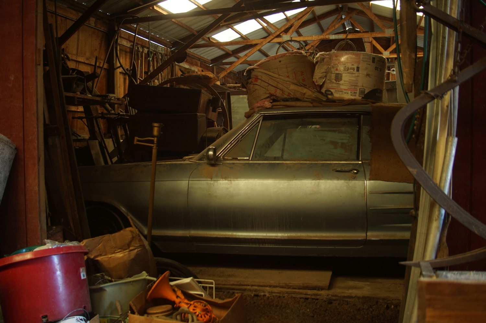

_Author's note: I originally wrote this on a different platform (as the date says, in 2019), and am transplanting it here. I dug up the originals of all of the photos and wrote alt text for them, but the text of the post remains completely unchanged. As a matter of fact, I haven't even re-read it._

This is a story about farming. It is quite long. I think it may be worth reading anyway, but unfortunately I have no way to prove it. I’ve also tried my best but I still don’t know if it actually makes perfect sense in every way? But it did all actually happen; so it all kind of has to make at least a little bit of sense, even if doesn’t really seem like it.

<!-- more -->

The trouble all started in 1901, when my great great grandfather emigrated to the United States from the modern-day Czech Republic and later, in 1911, bought a 90-acre farm there. Many years later, most of that farm came to belong to my grandfather, and roughly 10 years back he retired from his job selling tires at the tire store and started making the 40 mile drive north to the farm to spend his summer days there and plant a garden (in the area that wasn’t already rented out to be planted with soybeans.) Not long after that, he had enough produce to start selling stuff at a nearby farmers’ market in an upscale town, physically not far from the farm, although psychogeographically immensely distant from that chunk of desolate, isolated, fairly representative rural Ohio.

I was dragged in in the summer of 2015, from the end of June to the beginning of July, mostly pounding stakes into the ground so that the roughly 1000-1500 tomato plants that my grandfather had planted that year (with occasional help from my grandmother and uncle) could be tied up between them and the fruit wouldn’t lay on the ground and rot easily. I hated it there (in fairness, I probably would’ve hated anything that involved leaving the house during that time in my life) and when my dad got me out of it (by hiring me to help him paint a house) I quickly divested myself of the money I’d received there to wash my hands of the place and resolved never to go back. My dad was never in favor of me going to the farm, knowing as he did that the work could be dangerous (operating old, large, and unreliable tractors and backhoe with minimal training or safety precautions; running large, dangerous power saws in creative ways without the proper guards, gear, or safety precautions, mostly to put points on stakes; operating saws in an unsafe manner while standing in the raised bucket of the old and unreliable backhoe in order to trim trees; etc) and probably also suspected that I personally (especially then) was fairly vulnerable to being psychologically manipulated into performing difficult tasks that I was unhappy doing over a long period of time while being underpaid under some circumstances. Hmm.

I returned to the farm for the entirety of the summer of 2016. After barely surviving/graduating my senior year of high school that year I had given up on life and settled pretty quickly back into the routine of the daily back-and-forth farm trips. It is true that I was getting paid; it was also true that I was being challenged and learning things, mostly the basics of planting vegetables, like which plants were cold-season crops and which were warm-season and how far apart to space the transplants, and how a PTO works on a tractor; and it’s certainly a fact that on a personal level, I was still completely taken in by my grandfather’s wit and farm wisdom and overpowering managerial confidence. I made myself completely subordinate to him, and blamed myself when his ideas for what we should be doing next were completely obvious to him but rather opaque to me; I remember it frequently happening that he would tell me what to do and I would reflexively go off to do it, and then realize I was unclear on what he meant and have to timidly re-approach him for further instructions. This kind of slowed down the learning process. Much later I would also realize how superficial his constant confidence could be, and how it was often less the natural attitude of someone who knew what they were doing and more a tool he used to impress people into doing things without thinking too much about any of the potential alternatives. Also, according to my admittedly fallible memories, I was getting paid $35 per day for what were generally between 7 and 8 hour days. I was, in fact, 18 years old that year and probably could have gotten a different job that for one thing paid a better hourly wage and for another left me less reliant on the caprices of my family; but this was neither a thing that happened nor a thing that was expected from me, least of all by me. My internal world hadn’t expanded as I’d grown older; my universe of possibilities was limited to the things that were already present in my somewhat simple life. This was probably symptomatic of some larger problem or problems with the functionality of my brain at that point in my life.

One can become trapped in many different ways. You can be trapped in a specific city, or a zip code, or in a geographic region sorely lacking in cities, or one which they are considered entirely strange and outlandish things; in a job, in a career, in a lifestyle, or in a set of lifestyles considered realistic given your high school grades, ability to connect with others, and standing in society and life; in a friend group, or in an identity, or in a lack thereof, or in any number of the various rules and regulations that govern how one is allowed to interact with the rest of the human race; in a comedy, a tragedy, a pastoral narrative, or in any combination of the above kinds of story that one no longer wishes to be part of. For all I know, thanks to the stereotypical farm benefits of character building, meaningful work experiencing, and nature connecting-with, working at the farm for that year may have actually been good for me; nevertheless, I wish that it had been my last full summer there. I had showed up, learned some stuff, earned a small amount of money, and, in retrospect experienced at least the majority of what this particular 90 acre area of the planet had had to offer. Alas.

2017! This year, we had a pretty consistent schedule that I can remember clearly to this day: we left at 9:30 AM, when my grandfather would pull into my driveway and blow his horn, and got back between 7 and 8 o’clock at night. Built into that schedule is a one hour commute each way (we both lived about 40 miles away from the farm, which was actually inhabited by my uncle, who was often around and occasionally helped with the work but frequently made fairly abrasive and critical comments (if often correct) comments about it (for example, about the fact that our work day started so late in the morning)) and a daily grocery store stop for drinks for the cooler. I was the driver (once my grandfather’s problems with what I suspect is undiagnosed narcolepsy had almost killed us a couple of times) which you would think give me control over the stereo, but I quickly learned that my grandfather had pretty specific taste in music (country from the 50s and 60s) and a temperament unsuited to most podcasts. Obviously, most of that time in the daily schedule was taken up by the work day (so generally either planting tomatoes (which gets a little less rewarding after about the 500th one, which that year only put us at about a quarter of the way through the tomato plants, not counting the hundreds of eggplant, cabbage, and zucchini plants or the miscellaneous corn, squash, and beans), pounding stakes and tying string for the tomatoes, or harvesting tomatoes) which lay at the end of the lonely highway on a lonely work site at which the same 2-4 people showed up every day. (It became four people once you counted my younger brother, who came up to the farm that year until the start of marching band season got him out of it, and who fortunately made it his main job to get everyone to pack up and leave promptly at the end of the day. Once he stopped showing up, and even though I persuaded my grandfather to move the schedule up an hour so that we could get home earlier, we never left as consistently as we did when he was there; I didn’t have the stamina to find my grandfather (who didn’t carry a phone or a watch) and tell him what time it was at the end of the day every single day so that he could start to think about leaving.) I was being paid $40 a day, with a $20 bonus for market days once they started, which with our theoretically 35-hour work week ends up being about $6.29 an hour? Huh. In addition to the extra $20, the market season was nice because picking stuff is less tiring and more rewarding than planting stuff, and because I got to see way more people every day in the form of our market customers, even if I was interacting with them mainly through the intermediary of my grandfather.

Another nice thing is that this is the first year I have a decent photo album for! I started experimenting with old 35mm film cameras in late June and by early July I had my first interchangeable-lens digital camera, which I relied upon to keep my brain alive for large parts of the summer. I have… a lot of pictures from this season.

Finally, at the end of the year, I ended up in college. Any criticisms of my grandfather that I might offer up here have to be tempered by the fact that he did in fact drive me to the local (relatively) cheap higher-education dispenser and basically registered me for me (technically, I applied but there’s a 100% acceptance rate.) This was something I desperately wanted to do but was unable to make happen by myself. I won’t say that my grandfather every really understood the problems I went through while experiencing formal education, but as perhaps the member of my family least comfortable himself with the concept and culture of higher education, he was the most willing to notice and accept that I needed help getting started with it.

However, I did do quite badly that semester (I started out enrolled in 4.5 classes and ended enrolled in 2, with a C average) and going to the farm to work 4 days a week still (after morning classes and also on Saturday) did not help that except in that it provided a convenient distraction from it; an opportunity for me to distract myself from my frustrations by wearing myself out.

Why did I come back to the farm for 2018? I wasn’t happy there in 2017, I have the journal entries to prove it. Reasons: it was the path of least resistance, it was something I was more already familiar with than any other job, and my grandfather remained a very difficult person for me to say no to. (Also, he asked me (and my brother) to commit in midwinter, when it still seemed non-threatening and pretty far away.) The schedule was pretty much the same as I described for last year except that for some reason we went up 6 days a week as often as 5 (weather permitting.) My brother went up with us for the same period of time as he had previously, but was even more ornery this year than he was the last, which was an accomplishment; this didn’t stop me from being grateful for his presence. Mostly, I recruited him to work on whatever I was working on during the day, whenever I had a specific project: like building a fence around the second patch, or digging drainage ditches on the lawn, or moving the rainwater collection tank trailer to water stuff before Grandpa could realize that something that he didn’t plan for us was happening. My uncle became extremely fond of complaining that we were getting less done working on the same thing together than we might have working on different things far apart; this may have been true, but I was unwilling to test the theory.

As I implied above, I had a lot more freedom this year to pick projects that I thought needed to be done instead of following instructions all day, as long as I could seem confident about it under scrutiny later. I responded in two ways: I started wearing earbuds and listened to music and occasionally podcasts for most of the day, which was great except that it ruined earbuds and made me feel slightly spacey like I wasn’t even physically there sometimes, given that it was the main input that was actually making it to my brain, and I gave myself three new jobs. The first was to pick, display, and sell produce at a roadside stand that I set up back home (ideally without attracting too much attention from my uncle, who was doing the same thing); the second was to start picking for and selling at a new weekday farmers’ market; and the third was to fix an old dump truck that had been sitting in the back barn for the better part of the decade with a broken brake line, with the help of my dad, who came up to the farm a few days to show me what to actually do. The stand was very successful but 20% went to my mom for stocking it during the day and another 20% went to my grandfather for owning the farm; the new farmers’ market only required me to pay off my grandfather but had too many vendors for the customer base and was generally very slow; and the truck project was a huge disaster that consumed countless hours and brain cells: one brake line burst after another, we ended up having to remove and replace the two brake cylinders in each of the back wheels (which necessitated jacking the 12.5 ton vehicle up and removing both rear wheels and axles), the wiring for the lights was fucked from a previous botched repair job by a person or persons unknown, the bed needed to be attacked with the farm’s one working boom truck to get it to even move, and even after it was going up and down smoothly the hydraulic pump was occasionally leaking fluid, which I was neither qualified for or willing to try to fix; then, during the first test drive with a potential buyer, the radiator apparently exploded, and he convinced my grandfather to sell it to him for $1000, which was split between him, me, and my dad and uncle for helping (more or less.) I eventually calculated that with those three extra projects in addition to my regular salary (up $5 a day but without the weekly bonus, resulting in a net raise of $5 a week) I nearly made minimum wage working there that summer. (Hey, if Quinn is going to read this, I should probably note that minimum wage in Ohio was $8.15 an hour, at least when I wrote this, it’s up to $8.55 an hour now.)

Also, after going on three years of the whole “pull into Mitch’s driveway and blow the horn for a while” routine, the horn on my grandfather’s F-150 finally gave out and he locked the keys in my car while climbing inside of it to use its. (He did admit to this but also told me that I should never have left the keys inside of a car with “automatic locks.”) I had a much better spring semester this year, but it still wasn’t made easier by my 28 hours a week at the farm (plus the commute) right up until October 25th, when I finally quit.

Performance review:

Another part of my feelings about the farm that I have to mention is that the whole time I was there, I was pretty well aware that it was not nearly as productive as it should have been. One large part of this was just flawed soil management practices; by the time I got there, my grandfather had been planting mostly the same plants in mostly exactly the same spots for nearly 10 years, which is absolutely not how any of that is ever supposed to work. He sent soil samples away for analysis, got back reports prescribing long lists of fertilizers to be applied in massive quantities to help production, and then went back to using what he was planning on putting down anyway (mostly starting fertilizer (which we dragged around in 5 gallon buckets for the entire planting season), calcium spray to try to prevent previous years’ blossom end rot epidemics, and some poorly labeled sacks of miscellaneous stuff that he had gotten at a farm auction and that had been taking up space in a barn for years.) My grandfather’s managerial attitude was that all ideas were suspect unless they occurred to him first, which meant it sometimes required some stamina to get certain things done; he would ride up on the lawn mower and stare at you suspiciously if he wasn’t sure of exactly what you were doing.

Like this.

(Of course, the farm was not really run with the purpose of maximizing production, anyway. My grandfather kept it going year after year initially because he was retired, and wanted something to take up his time, and because he wanted to turn himself into a farmer; later, he got the idea that he was going to turn me into one.)

The other main obstacle to growth was the fact that we were surrounded by 80 acres of soybean fields that were at a slightly higher elevation than our plants, which meant that 2 inches of rainfall was more than enough to flood the place. This is not actually a good thing for any plant’s growth (except for cucumbers, and I guess sometimes zucchini.) I ended up (with my brother) digging hundreds of feet of drainage ditches in 2018 to try to combat this. Like, with a shovel. We had a trencher, but its hydraulic pump leaked fluid like a sieve, which had prevented it from being used for years, kind of like that dump truck I mentioned fixing earlier. Other broken down equipment included two boom trucks (one of which was specifically designed just to lay railroad ties), two full-size tractors (an Oliver and a Farm-All), a handful of mechanical tractor attachments that lay scattered throughout the barn-adjacent grass, a smallish red Troy-Bilt riding lawn mower, and a 1963 Buick Riviera.

On a personal level, going to the farm every day felt like dying? It was long hours of difficult, tedious, low-paid work in a desolate and isolated location. It was sort of like a sensory deprivation chamber, but for thoughts and feelings instead of for senses. On one hand, I regret every single miserable second of it, and hope to never see the place again for as long as I somehow manage to live (sadly unlikely); on the other hand, I do think it made me more appreciative of the moments when I do feel like I’m alive in the world, even when they’re not exactly easy ones. I have more enthusiasm for certain types of fear now, like driving to a strange and distant city to see a band play by myself, actually talking to the host in the AirBNB there, and descending into a strange subway system without really knowing how I’m going to get anywhere I’m trying to go from there; or signing up for classes for next semester without knowing exactly what they’ll be like, and talking to the strange person sitting next to me, or even just emailing the professor to ask for an explanation of an assignment that I don’t understand. It reminds me that I’m not as trapped anymore.

This contradicts what I want to be true, which is that the farm was just a background event in my life, instead of something that defined it for all of those years. The things that I was doing in the background of this, the story about farming, were the things I now realize were actually important to me at the time: taking those pictures, going back to school, the music I was listening to while I was out in the field, pounding in tomato stakes… I was also re-learning the piano in the evenings when I still had the energy. Unfortunately, the farm did define that part of my life to a large extent because of the way it served as an obstacle to me pursuing those things. The thing is, I wasn’t really trapped there, in any real physical or consequential sense; the farm took over my life because I was unable to recognize and act on the fact that I did have access to real sources of happiness.

Also, I guess the whole time I was technically committing tax evasion?

Anyway, whenever I see one of those posts about how nice it would be just to leave society and go live on a farm or something, this is what I’m thinking of.
